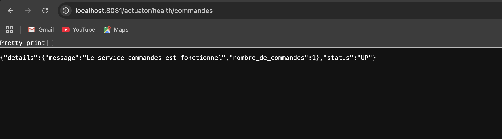
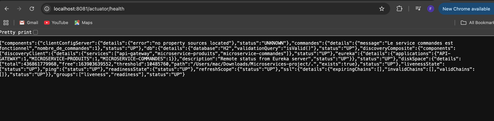
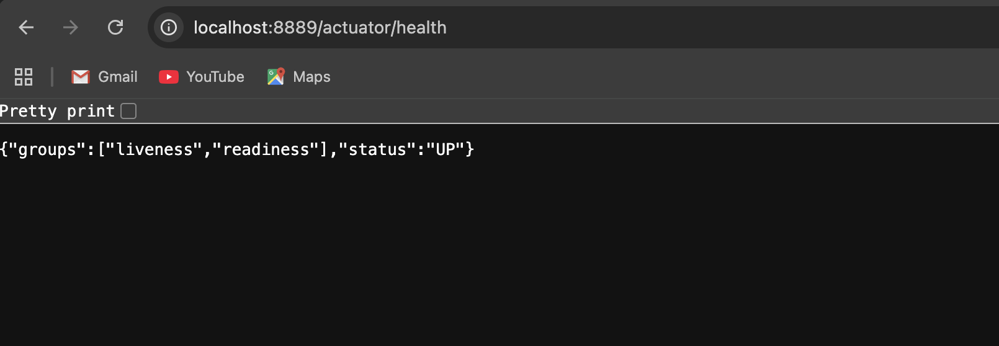
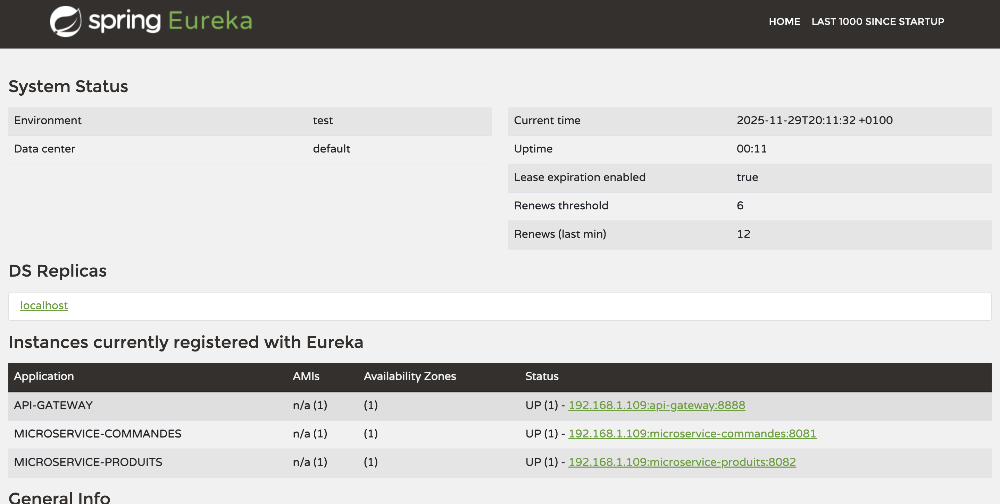
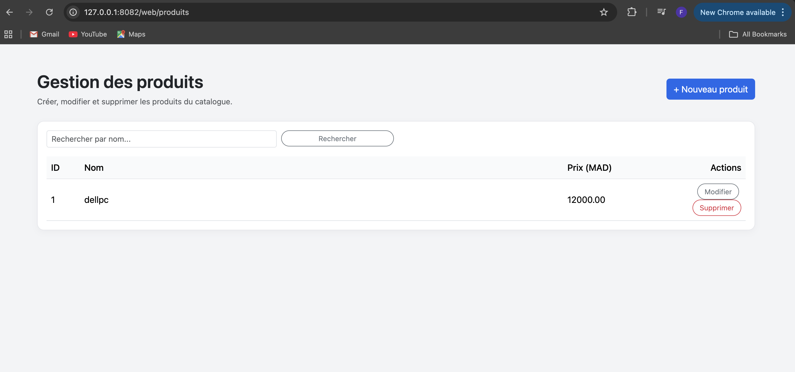
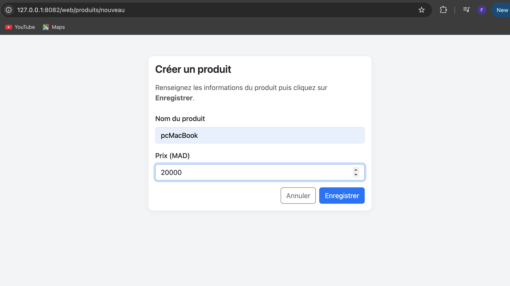
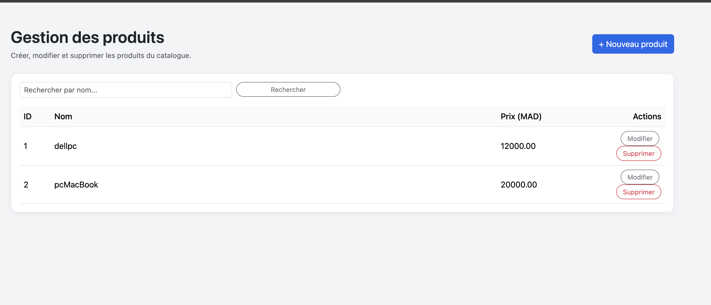
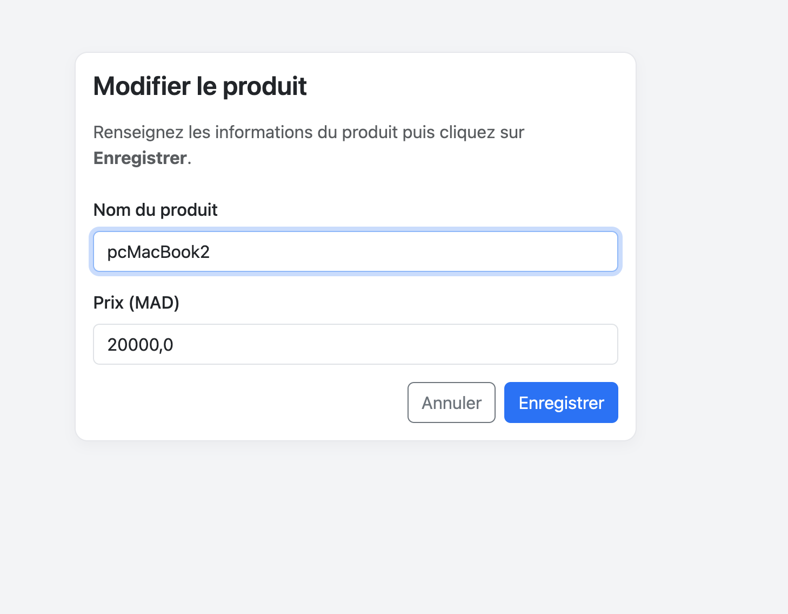
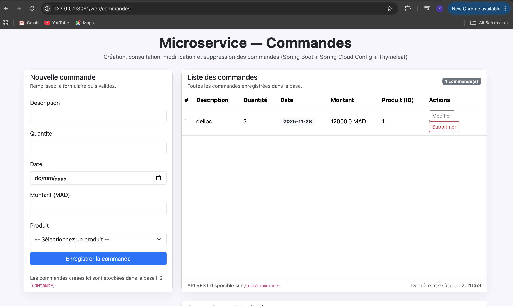

# 🚀 Microservices Project – Spring Boot, Spring Cloud, Eureka, Gateway & Config Server

Ce projet est une architecture microservices complète développée avec **Spring Boot** et **Spring Cloud**.  
Il inclut plusieurs services indépendants communiquant entre eux via **Eureka Discovery**, un **API Gateway**, et un **Config Server**.

---

## 🧱 Architecture du Projet

### ✔️ Microservices inclus :
- **eureka-server** – Service Discovery (registre)
- **config-service** – Chargement centralisé de la configuration
- **gateway-service** – API Gateway basé sur Spring Cloud Gateway
- **microservice-produit** – Service Produits (CRUD)
- **Commandes-service** – Service Commandes (CRUD + communication avec Produits)

---

## 🏗️ Technologies utilisées

| Technologie | Description |
|------------|-------------|
| Spring Boot | Framework principal pour construire les microservices |
| Spring Cloud Netflix | Eureka Server / Eureka Client |
| Spring Cloud Gateway | API Gateway pour router les requêtes |
| Spring Cloud Config | Gestion centralisée de la configuration |
| OpenFeign | Communication inter-services |
| Resilience4J | Circuit breaker et fallback |
| Lombok | Réduction du boilerplate |
| H2 Database | Base de données en mémoire |
| Maven | Gestionnaire du build |

---
## 🏗️ Screenshots

# Realisation
Realisé par: **LAALIOUI Fatima zahrae**

